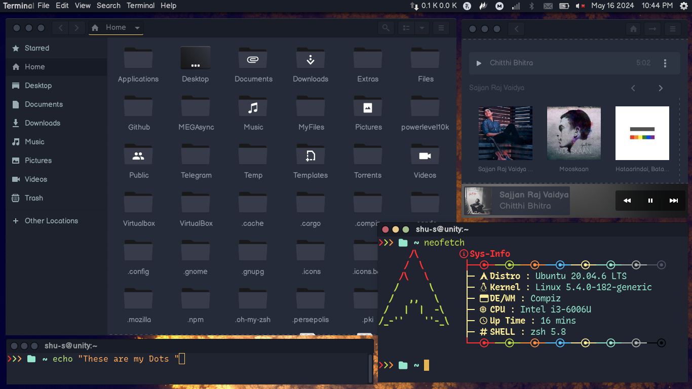
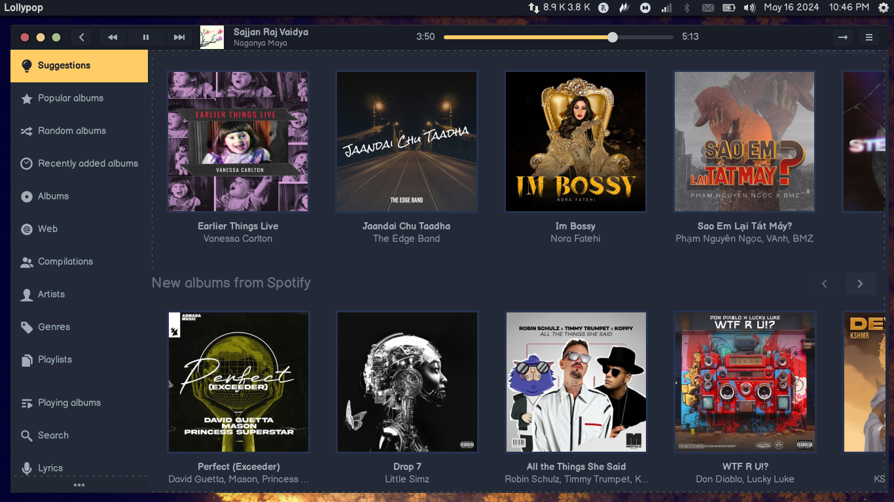
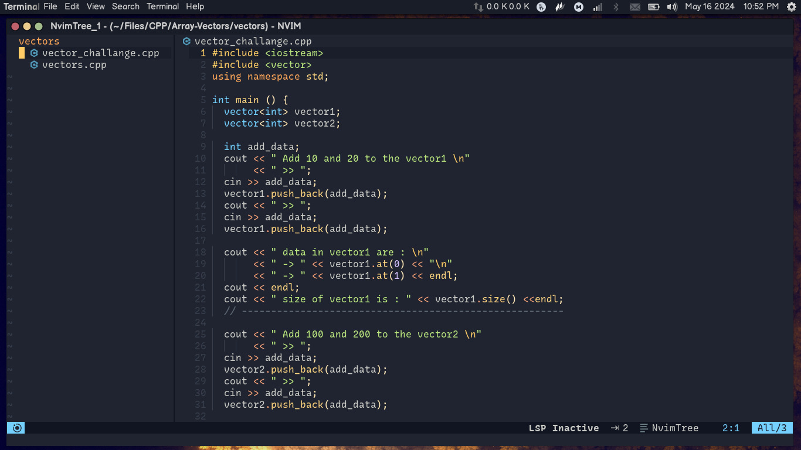
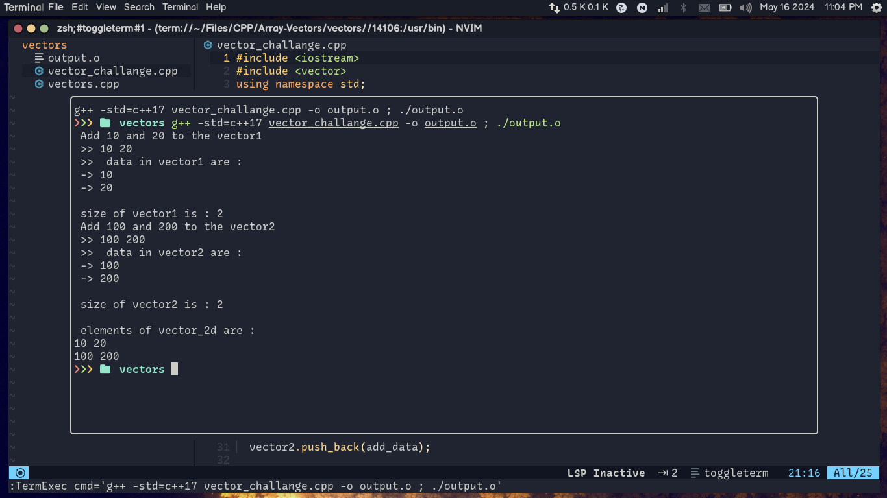
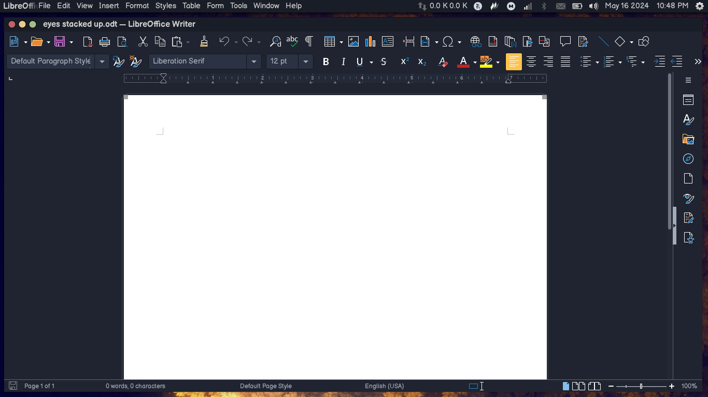
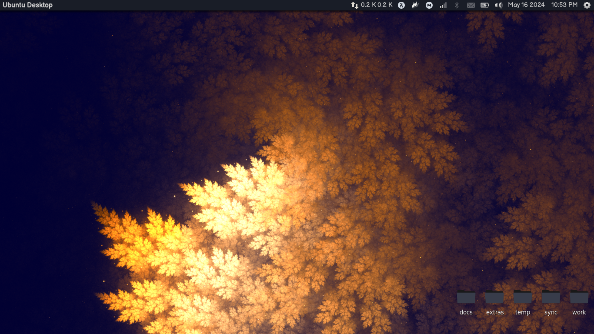
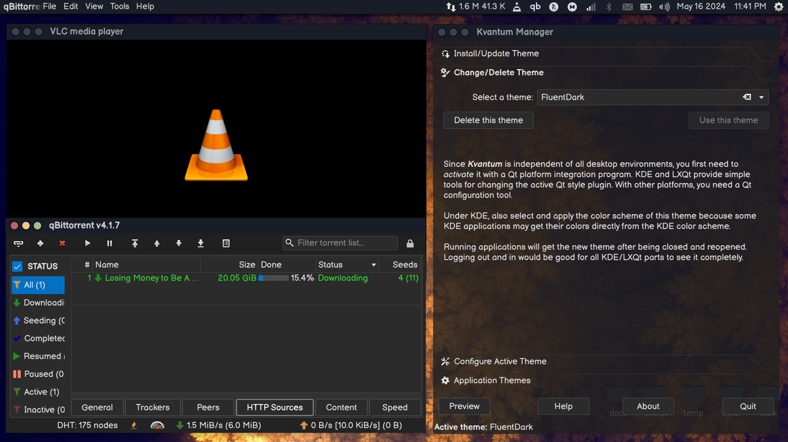
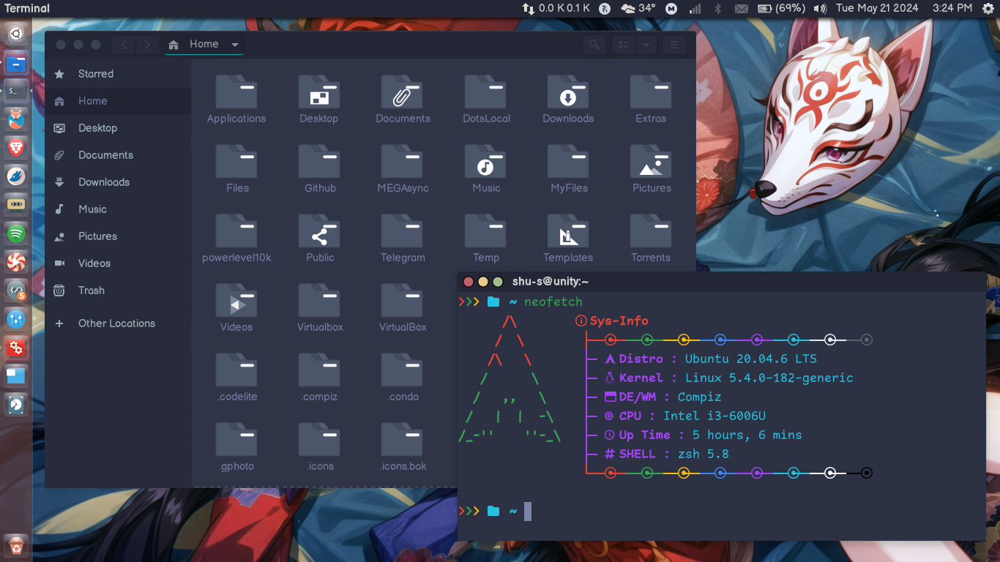

these are my personal dotfilles

    DE          :  Unity7.5
    WM          :  Compiz
    Terminal    :  Gnome-terminal
    Editor      :  nvim
    FileManager :  Nautilus
    Ofiice      :  Libre
    MusicPlayer :  lollypop
    VideoPlayer :  mpv[Primary], vlc[Secondary]
    Torrent     :  qbittorrent

    Gtk-Theme   :  Juno-Mirage
    Qt-theme    :  FluentDark[kvantum]

    Icon-theme  :  FlatOnBlack [Mix of several themes..]
    

Screenshots:

juno palenight + Butterfly-Remix [it's mix of oranchelo-icon-theme, obisidian and zafiro]

